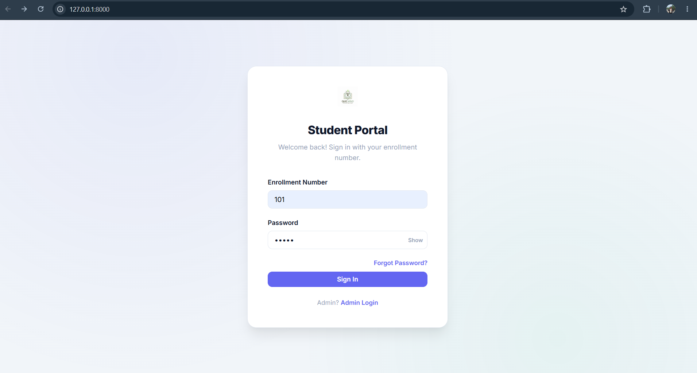
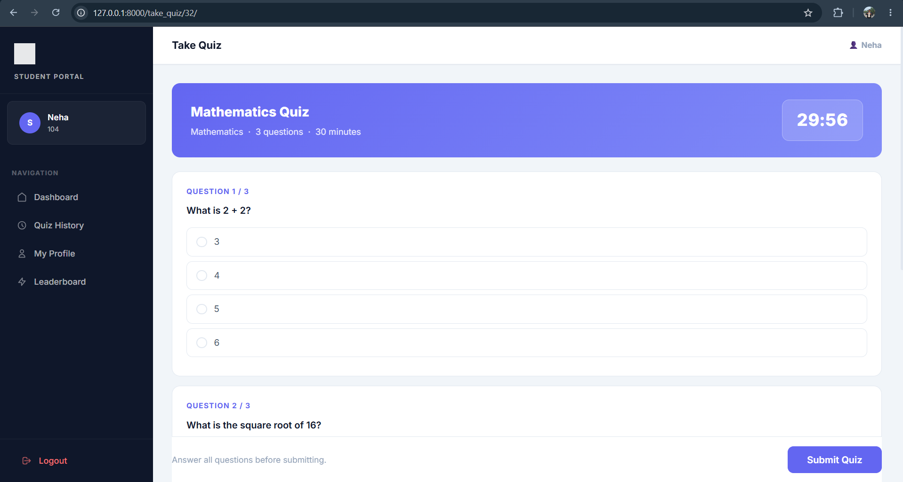
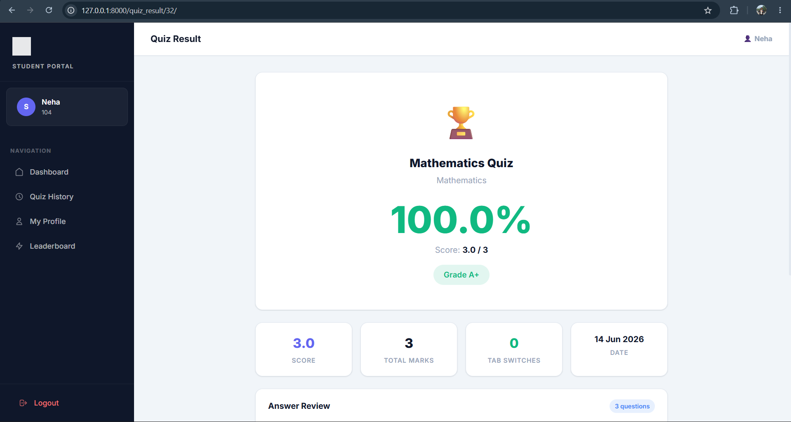
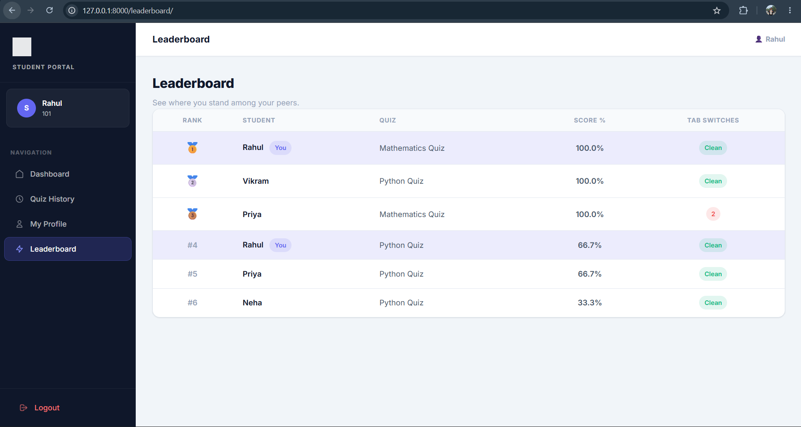

# quizopedia---a-report-card-generation
# Quizopedia

Quizopedia is a web-based quiz application developed using Django. It provides an interactive platform where users can test their knowledge through multiple-choice quizzes, track their scores, and improve their learning experience.

## Features

* User Registration and Login
* Multiple Quiz Categories
* Multiple-Choice Questions
* Instant Score Calculation
* Result and Performance Summary
* Responsive User Interface
* Admin Panel for Managing Questions and Categories

## Technologies Used

* Python
* Django
* HTML5
* CSS3
* JavaScript
* SQLite

## Screenshots

### Home Page




### Quiz Interface



### Results Page



### Leaderboard



## Installation

1. Clone the repository:

```bash
git clone <repository-url>
```

2. Navigate to the project directory:

```bash
cd Quizopedia
```

3. Install dependencies:

```bash
pip install -r requirements.txt
```

4. Apply migrations:

```bash
python manage.py migrate
```

5. Start the development server:

```bash
python manage.py runserver
```

6. Open your browser and visit:

```text
http://127.0.0.1:8000/
```

## Project Structure

* User Authentication Module
* Quiz Management System
* Category Management
* Score Tracking System
* Admin Dashboard

## Future Enhancements

* Timed Quizzes
* Difficulty Levels
* User Leaderboards
* Performance Analytics
* Certificate Generation
* API Integration

## Learning Outcomes

Through this project, I gained practical experience in:

* Django Web Development
* Database Management
* User Authentication
* CRUD Operations
* Frontend and Backend Integration
* Version Control with Git and GitHub

## Author

Hardik Patel

GitHub: https://github.com/hardikpateliteng
